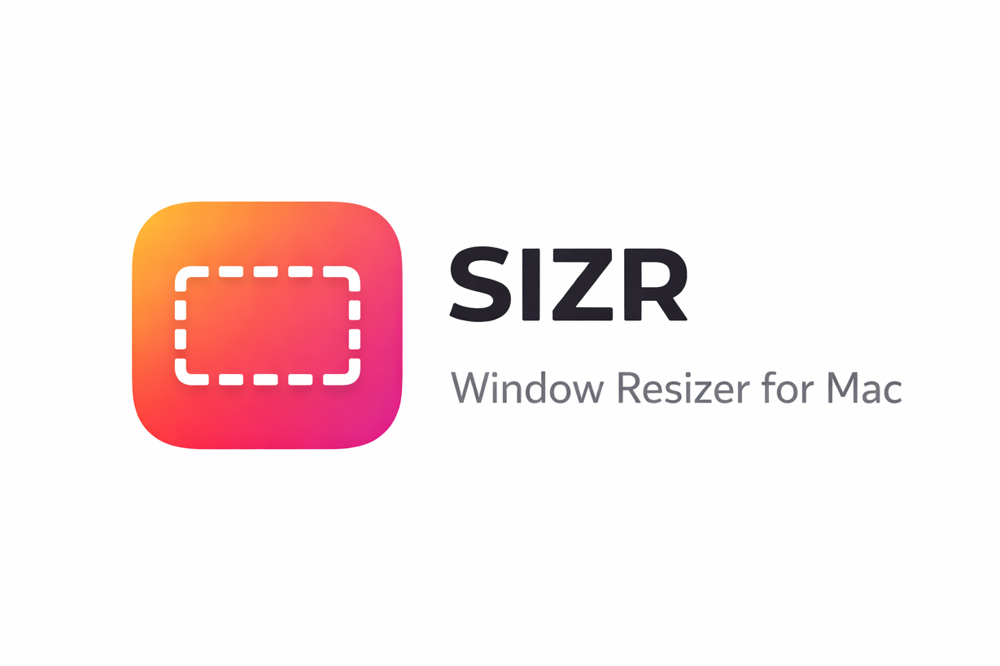

# SIZR

<p align="center">
  
</p>

<p align="center">
  <strong>Precise window resizing for macOS.</strong><br />
  Resize windows to an exact size from the menu bar, without snapping, layouts, or window manager complexity.
</p>

## Overview

SIZR is a lightweight macOS menu bar utility built for one job:

set the active window to an exact size, instantly.

It is designed for people using large, 4K, wide, or ultrawide displays who want a fast way to say:

- `make this window 1920×1080`
- `make this one 1440×900`
- `apply my custom size`

No grids. No zones. No tiling. No workspace rules.

Just exact window resizing.

## How It Works

When you trigger an action, SIZR:

1. detects the active app
2. applies the requested size through macOS Accessibility APIs

Window sizes are applied as full window frame dimensions.

## Installation

### Run from source

Open [SIZR.xcodeproj](./SIZR.xcodeproj) in Xcode, choose the `SIZR` scheme, and run the app on `My Mac`.

### Build from command line

```bash
DEVELOPER_DIR=/Applications/Xcode.app/Contents/Developer \
/Applications/Xcode.app/Contents/Developer/usr/bin/xcodebuild \
-project SIZR.xcodeproj \
-scheme SIZR \
-configuration Debug \
-derivedDataPath ./.derivedData \
CODE_SIGNING_ALLOWED=NO \
build
```

The built app will be available at:

```text
./.derivedData/Build/Products/Debug/SIZR.app
```

You can then copy it to `/Applications`.

## Permissions

SIZR needs **Accessibility** permission to control windows from other apps.

To enable it:

1. Launch `SIZR.app`
2. Open the menu bar app
3. Use `Grant Access`, or go manually to:
4. `System Settings > Privacy & Security > Accessibility`
5. Enable `SIZR`

For the most reliable behavior, test the installed app from `/Applications/SIZR.app`.

## Usage

Once SIZR is running in the menu bar:

- click `Resize to 1920×1080` for the default exact resize
- click `Custom...` to enter your own width and height
- click `Apply`

If a window cannot be resized, SIZR shows a short, human-readable error.

## Tech Stack

- Swift
- SwiftUI
- `MenuBarExtra`
- macOS Accessibility APIs
- `SMAppService` for launch at login

## Development

### Run tests

```bash
DEVELOPER_DIR=/Applications/Xcode.app/Contents/Developer \
/Applications/Xcode.app/Contents/Developer/usr/bin/xcodebuild \
-project SIZR.xcodeproj \
-scheme SIZR \
-configuration Debug \
-derivedDataPath ./.derivedData \
CODE_SIGNING_ALLOWED=NO \
test \
-destination 'platform=macOS'
```
